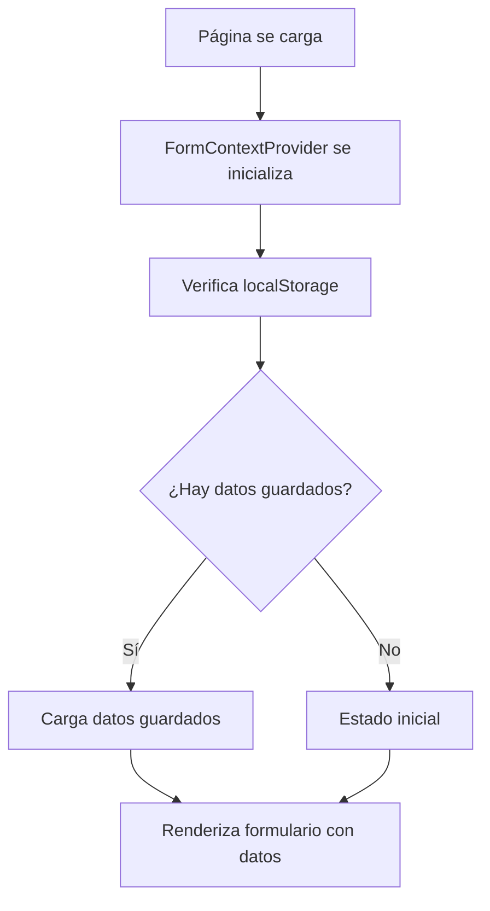
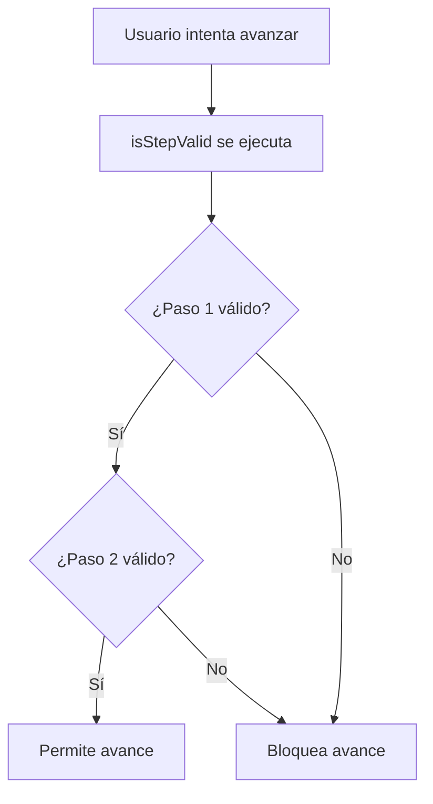
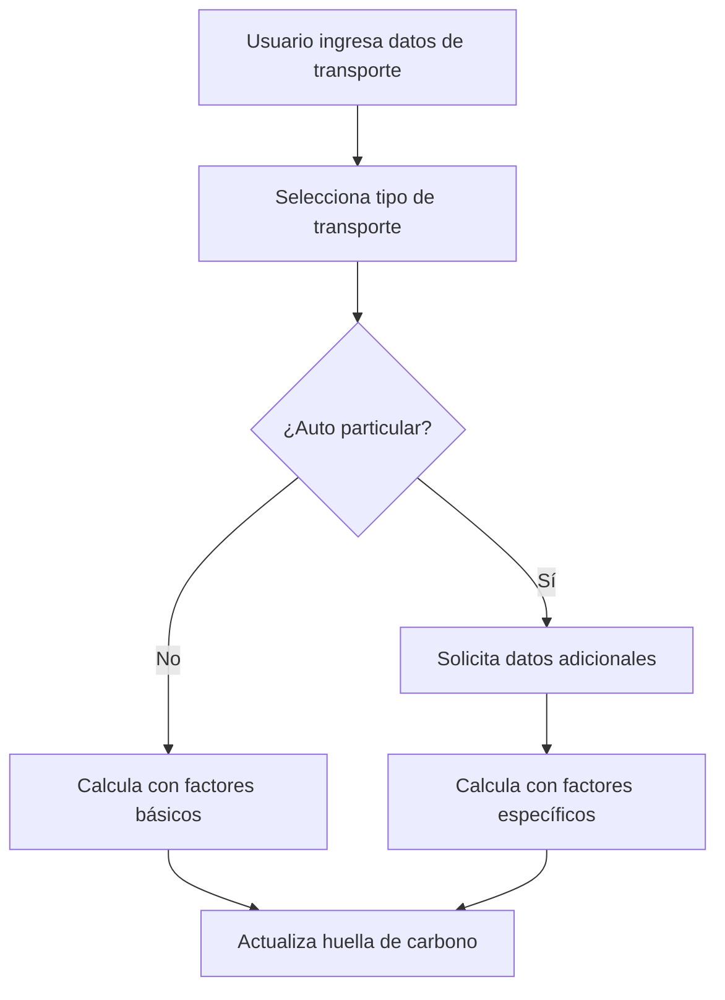

# CAU Avisos - Sistema de Gestión de Avisos de Salida

## 📋 Descripción General

Sistema web para la gestión de avisos de salida del Club Andino Universitario (CAU). Permite crear, gestionar y generar avisos de salida para actividades de montañismo con funcionalidades avanzadas de persistencia de datos, gestión de participantes, equipamiento, transporte y cálculo de huella de carbono.

## 🏗️ Arquitectura del Proyecto

### Tecnologías Utilizadas
- **Frontend**: Next.js 15.2.4, React 19.1.0
- **Styling**: Tailwind CSS 4.1.4
- **Estado**: React Context API + useReducer
- **Persistencia**: LocalStorage
- **Deployment**: Vercel

### Estructura de Directorios
```
CAU_avisos/
├── src/
│   ├── app/                    # Next.js App Router
│   │   ├── layout.js          # Layout principal
│   │   ├── page.js            # Página principal
│   │   ├── globals.css        # Estilos globales
│   │   └── admin/             # Páginas de administración
│   │       ├── page.js        # Panel principal de admin
│   │       ├── people/        # Gestión de personas
│   │       ├── activities/    # Gestión de actividades
│   │       ├── equipment/     # Gestión de equipamiento
│   │       ├── forms/         # Gestión de datos de autocompletado
│   │       └── checklists/    # Gestión de checklists
│   ├── resources/
│   │   ├── constants/         # Datos constantes del sistema
│   │   ├── contexts/          # Contextos de React
│   │   ├── form/              # Componentes del formulario
│   │   │   ├── components/    # Componentes reutilizables
│   │   │   └── steps/         # Pasos del formulario
│   │   └── imgs/              # Imágenes del proyecto
│   └── public/                # Archivos estáticos
```

## 📁 Análisis Detallado de Archivos

### 1. Configuración del Proyecto

#### `package.json`
```json
{
  "name": "cau-avisos",
  "version": "0.1.0",
  "scripts": {
    "dev": "next dev",
    "build": "next build",
    "start": "next start"
  }
}
```
**Propósito**: Configuración del proyecto Next.js con dependencias y scripts.

#### `next.config.mjs`
**Propósito**: Configuración específica de Next.js para optimización y comportamiento.

#### `tailwind.config.js`
**Propósito**: Configuración de Tailwind CSS para estilos personalizados.

### 2. Páginas Principales

#### `src/app/layout.js`
```javascript
export default function RootLayout({ children }) {
  return (
    <html lang="es">
      <body>
        <FormContextProvider>
          <NavigationBar />
          {children}
        </FormContextProvider>
      </body>
    </html>
  );
}
```
**Propósito**: Layout principal que envuelve toda la aplicación con el contexto del formulario.

#### `src/app/page.js`
```javascript
export default function Home() {
  return (
    <div className="min-h-screen bg-gray-50">
      <MultiStepForm />
    </div>
  );
}
```
**Propósito**: Página principal que renderiza el formulario multi-paso.

### 3. Gestión de Estado

#### `src/resources/contexts/FormContext.js`
**Archivo Central del Estado**

**Estructura del Estado:**
```javascript
const initialFormState = {
  currentStep: 1,
  basicInfo: {
    contactoCAU: '',
    telefonoContacto: '',
    emailContacto: '',
    fechaHoraReporteRegreso: '',
    actividad: '',
    cerroOSector: '',
    // ... más campos
  },
  participantes: [],
  itinerario: [],
  equipo: [],
  transporte: [],
  cuerposRescate: []
};
```

**Funciones Principales:**
- `updateFormField(section, field, value)`: Actualiza campos específicos
- `addItem(section, item)`: Agrega elementos a arrays
- `removeItem(section, index)`: Elimina elementos de arrays
- `updateItem(section, index, updates)`: Actualiza elementos específicos
- `goToStep(step)`: Navega entre pasos
- `resetForm()`: Limpia todo el formulario
- `isStepValid(step)`: Valida si un paso está completo

**Persistencia de Datos:**
```javascript
// Guardado automático en localStorage
useEffect(() => {
  if (!isInitialized) return;
  const dataToSave = {
    ...formData,
    basicInfo: { ...formData.basicInfo, weatherImages: [] }
  };
  localStorage.setItem('formData', JSON.stringify(dataToSave));
}, [formData, isInitialized]);

// Carga automática desde localStorage
useEffect(() => {
  const savedData = localStorage.getItem('formData');
  if (savedData) {
    const parsedData = JSON.parse(savedData);
    dispatch({ type: 'LOAD_SAVED_DATA', data: parsedData });
  }
  setIsInitialized(true);
}, []);
```

**Reducer Actions:**
- `UPDATE_FORM_FIELD`: Actualiza campos del formulario
- `ADD_ITEM`: Agrega elementos a arrays
- `REMOVE_ITEM`: Elimina elementos de arrays
- `UPDATE_ITEM`: Actualiza elementos específicos
- `SET_STEP`: Cambia el paso actual
- `RESET_FORM`: Limpia todo el formulario
- `LOAD_SAVED_DATA`: Carga datos guardados
- `UPDATE_WEATHER_IMAGES`: Actualiza imágenes del clima

### 4. Datos Constantes

#### `src/resources/constants/peopleData.js`
```javascript
export const peopleData = {
  "juan.perez@cau.cl": {
    nombre: "Juan Pérez",
    telefono: "+56912345678",
    email: "juan.perez@cau.cl",
    grupoSanguineo: "O+",
    alergias: "Penicilina",
    medicamentos: "Ninguno",
    enfermedades: "Diabetes tipo 2",
    condicionesEspeciales: "Requiere insulina"
  }
  // ... más personas
};
```
**Propósito**: Almacena información de participantes y contactos CAU con datos médicos completos.

#### `src/resources/constants/activityEquipmentData.js`
```javascript
export const activityEquipmentData = {
  activities: {
    montañismo: {
      basicEquipment: [
        { item: "Botas de montaña", category: "Calzado", essential: true },
        { item: "Mochila", category: "Equipamiento", essential: true }
      ]
    }
  },
  specificActivities: {
    "travesía por glaciar": {
      equipment: [
        { item: "Crampones", category: "Equipamiento técnico", essential: true },
        { item: "Piolet", category: "Equipamiento técnico", essential: true }
      ]
    }
  }
};
```
**Propósito**: Recomendaciones de equipamiento basadas en actividades generales y específicas.

#### `src/resources/constants/equipmentData.js`
```javascript
export const equipmentData = {
  categories: [
    { id: "calzado", name: "Calzado", description: "Botas y zapatos" },
    { id: "ropa", name: "Ropa", description: "Vestimenta técnica" }
  ],
  items: [
    { id: "botas", item: "Botas de montaña", category: "calzado", essential: true },
    { id: "chaqueta", item: "Chaqueta impermeable", category: "ropa", essential: true }
  ]
};
```
**Propósito**: Categorías y elementos de equipamiento disponibles.

#### `src/resources/constants/transportOptions.js`
```javascript
export const transportOptions = {
  transportTypes: [
    { value: "auto particular", label: "Auto particular" },
    { value: "bus", label: "Bus (transporte público)" },
    { value: "taxi/uber", label: "Taxi/Uber" }
  ],
  carbonEmissionFactors: {
    fuelFactors: { gasolina: 0.15, diesel: 0.17, electrico: 0.05 },
    transportTypeFactors: { "auto particular": 0.20, bus: 0.08 },
    vehicleFactors: { suv: 0.25, sedan: 0.18, pickup: 0.28 }
  }
};
```
**Propósito**: Opciones de transporte y factores para cálculo de huella de carbono.

#### `src/resources/constants/riskManagementOptions.js`
```javascript
export const riskManagementOptions = {
  tipoSupuestos: [
    { value: "grupo_humano", label: "Grupo Humano" },
    { value: "condiciones", label: "Condiciones" },
    { value: "itinerario", label: "Itinerario" }
  ],
  probabilidades: [
    { value: "muy_improbable", label: "Muy improbable" },
    { value: "poco_probable", label: "Poco probable" }
  ],
  impactos: [
    { value: "minimo", label: "Mínimo" },
    { value: "manejable", label: "Manejable" }
  ]
};
```
**Propósito**: Opciones para gestión de riesgos y supuestos.

### 5. Componentes del Formulario

#### `src/resources/form/MultiStepForm.jsx`
**Componente Principal del Formulario**

**Funcionalidades:**
- Navegación entre pasos
- Indicador de progreso
- Persistencia de datos
- Validación de pasos
- Interfaz responsive

**Estado Local:**
```javascript
const [hasSavedData, setHasSavedData] = useState(false);
const [showSaveNotification, setShowSaveNotification] = useState(false);
```

**Funciones Principales:**
- `checkSavedData()`: Verifica si hay datos guardados
- `handleClearData()`: Limpia todos los datos guardados
- `getStepStatus(stepId)`: Determina el estado de un paso
- `getStepIcon(status, stepId)`: Renderiza iconos de estado

#### Pasos del Formulario

##### `src/resources/form/steps/Step1BasicInfo.jsx`
**Información Básica**
- Datos de contacto CAU
- Detalles de la actividad
- Fecha y hora de regreso
- Enlaces a pronósticos y rutas
- Carga de imágenes del clima

**Campos Principales:**
- `contactoCAU`: Contacto responsable
- `telefonoContacto`: Teléfono de contacto
- `emailContacto`: Email de contacto
- `fechaHoraReporteRegreso`: Fecha límite de regreso
- `actividad`: Tipo de actividad
- `cerroOSector`: Ubicación específica

##### `src/resources/form/steps/Step2Participants.jsx`
**Gestión de Participantes**
- Lista de participantes
- Datos médicos completos
- Contactos de emergencia
- Información personal

**Estructura de Participante:**
```javascript
{
  nombre: "Juan Pérez",
  rut: "12345678-9",
  telefono: "+56912345678",
  email: "juan@email.com",
  grupoSanguineo: "O+",
  alergias: "Penicilina",
  medicamentos: "Ninguno",
  enfermedades: "Diabetes",
  condicionesEspeciales: "Requiere insulina",
  contactoEmergencia: "María Pérez",
  telefonoEmergencia: "+56987654321"
}
```

##### `src/resources/form/steps/Step3ItineraryAssumptions.jsx`
**Itinerario y Supuestos**
- Días del itinerario
- Actividades por día
- Supuestos y riesgos
- Validación de fechas

**Estructura de Día:**
```javascript
{
  fecha: "2025-01-15",
  tramo: "Cerro San Ramón",
  actividades: ["Ascenso", "Descenso"],
  horaInicio: "08:00",
  horaFin: "18:00",
  altitudInicio: 800,
  altitudFin: 1800,
  supuestos: [
    {
      supuesto: "Condiciones climáticas favorables",
      tipoSupuesto: "condiciones",
      probabilidad: "algo_probable",
      impacto: "significativo",
      incluir: true
    }
  ]
}
```

##### `src/resources/form/steps/Step4RiskManagement.jsx`
**Gestión de Riesgos**
- Identificación de riesgos
- Análisis de probabilidad e impacto
- Planes de mitigación
- Gestión detallada de supuestos

**Campos de Riesgo:**
- `ubicacion`: Ubicación del riesgo
- `probabilidad`: Probabilidad de ocurrencia
- `exposicion`: Nivel de exposición
- `riesgo`: Descripción del riesgo
- `peligro`: Peligro específico
- `lugar`: Lugar específico
- `accionProbabilidad`: Acción para probabilidad
- `accionExposicion`: Acción para exposición
- `accionConsecuencias`: Acción para consecuencias

##### `src/resources/form/steps/Step5EquipmentTransport.jsx`
**Equipamiento y Transporte**
- Lista de equipamiento
- Recomendaciones automáticas
- Gestión de transporte
- Cálculo de huella de carbono

**Funcionalidades de Equipamiento:**
- Carga automática de recomendaciones
- Integración con checklists de Wikiexplora
- Categorización de equipamiento
- Marcado de elementos esenciales

**Funcionalidades de Transporte:**
- Múltiples tipos de transporte
- Cálculo automático de huella de carbono
- Campos condicionales según tipo
- Validación específica por tipo

**Cálculo de Huella de Carbono:**
```javascript
const calculateCarbonFootprint = (transport) => {
  const { distancia, tipo, tipoCombustible, tipoAuto, anioVehiculo, capacidad } = transport;
  
  if (tipo === 'auto particular') {
    const fuelFactor = carbonEmissionFactors.fuelFactors[tipoCombustible];
    const vehicleFactor = carbonEmissionFactors.vehicleFactors[tipoAuto];
    const efficiencyFactor = getEfficiencyFactor(anioVehiculo);
    const occupancyFactor = getOccupancyFactor(capacidad, tipo);
    
    return distancia * fuelFactor * vehicleFactor * efficiencyFactor * occupancyFactor;
  }
  
  // Otros tipos de transporte...
};
```

##### `src/resources/form/steps/Step7FinalReview.jsx`
**Revisión Final**
- Resumen completo del aviso
- Validación final
- Generación del documento
- Vista previa de impresión

### 6. Componentes Reutilizables

#### `src/resources/form/components/AutocompleteInput.jsx`
**Input con Autocompletado**
```javascript
export default function AutocompleteInput({
  value,
  onChange,
  suggestions,
  placeholder,
  required = false,
  label = null
}) {
  // Lógica de autocompletado
}
```
**Propósito**: Input con sugerencias automáticas para campos como contacto CAU, actividades, etc.

#### `src/resources/form/components/EquipmentTable.jsx`
**Tabla de Equipamiento Editable**
```javascript
export default function EquipmentTable({ equipment, onUpdate, onRemove }) {
  // Tabla editable con categorías, cantidades y acciones
}
```
**Propósito**: Tabla interactiva para gestionar equipamiento con categorías y cantidades.

#### `src/resources/form/components/TransportForm.jsx`
**Formulario de Transporte**
```javascript
export default function TransportForm({ transport, onUpdate, onRemove, index }) {
  // Formulario con campos condicionales según tipo de transporte
}
```
**Propósito**: Formulario dinámico para datos de transporte con cálculo de huella de carbono.

#### `src/resources/form/components/PrintView.jsx`
**Vista de Impresión**
```javascript
export default function PrintView({ formData, onClose }) {
  // Generación del documento final para impresión
}
```
**Propósito**: Genera el documento final del aviso de salida con formato profesional.

### 7. Páginas de Administración

#### `src/app/admin/page.js`
**Panel Principal de Administración**
- Navegación a todas las secciones
- Resumen de funcionalidades
- Enlaces directos a gestión

#### `src/app/admin/people/page.js`
**Gestión de Personas**
```javascript
export default function PeopleAdminPage() {
  return (
    <div className="container mx-auto p-6">
      <PeopleAdminPanel />
    </div>
  );
}
```
**Propósito**: Gestión completa de participantes y contactos CAU.

#### `src/resources/form/components/PeopleAdminPanel.jsx`
**Panel de Gestión de Personas**
- CRUD completo de personas
- Gestión de datos médicos
- Exportación de datos
- Validación de información

#### `src/app/admin/activities/page.js`
**Gestión de Actividades**
```javascript
export default function ActivitiesAdminPage() {
  return (
    <div className="container mx-auto p-6">
      <ActivitiesAdminPanel />
    </div>
  );
}
```
**Propósito**: Gestión de actividades y sus recomendaciones de equipamiento.

#### `src/resources/form/components/ActivitiesAdminPanel.jsx`
**Panel de Gestión de Actividades**
- Gestión de actividades generales
- Gestión de actividades específicas
- Recomendaciones de equipamiento
- Exportación de datos

#### `src/app/admin/equipment/page.js`
**Gestión de Equipamiento**
```javascript
export default function EquipmentAdminPage() {
  return (
    <div className="container mx-auto p-6">
      <EquipmentAdminPanel />
    </div>
  );
}
```
**Propósito**: Gestión de categorías y elementos de equipamiento.

#### `src/resources/form/components/EquipmentAdminPanel.jsx`
**Panel de Gestión de Equipamiento**
- CRUD de categorías
- CRUD de elementos
- Marcado de elementos esenciales
- Exportación de datos

#### `src/app/admin/forms/page.js`
**Gestión de Datos de Autocompletado**
```javascript
export default function FormsAdminPage() {
  return (
    <div className="container mx-auto p-6">
      <FormsAdminPanel />
    </div>
  );
}
```
**Propósito**: Gestión de sugerencias y datos de autocompletado para formularios.

#### `src/resources/form/components/FormsAdminPanel.jsx`
**Panel de Gestión de Formularios**
- Gestión de opciones básicas
- Gestión de opciones de riesgo
- Gestión de opciones de transporte
- Gestión de datos médicos
- Gestión de supuestos

#### `src/app/admin/checklists/page.js`
**Gestión de Checklists**
```javascript
export default function ChecklistsAdminPage() {
  return (
    <div className="container mx-auto p-6">
      <ChecklistsAdminPanel />
    </div>
  );
}
```
**Propósito**: Visualización y gestión de checklists de Wikiexplora.

#### `src/resources/form/components/ChecklistsAdminPanel.jsx`
**Panel de Gestión de Checklists**
- Visualización detallada de checklists
- Estadísticas de elementos
- Exportación individual
- Información completa

### 8. Datos y Constantes

#### `src/resources/constants/wikiexploraChecklists.js`
**Checklists de Wikiexplora**
```javascript
export const wikiexploraChecklists = {
  montañismo: {
    name: "Montañismo",
    imprescindibles: [
      { categoria: "Calzado", cantidad: 1, observaciones: "Botas de montaña" }
    ],
    aconsejables: [
      { categoria: "Ropa", cantidad: 1, observaciones: "Chaqueta impermeable" }
    ]
  }
};
```
**Propósito**: Checklists especializados para diferentes actividades.

#### `src/resources/constants/basicFormOptions.js`
**Opciones Básicas del Formulario**
```javascript
export const basicFormOptions = {
  actividades: ["Montañismo", "Escalada", "Trekking"],
  actividadesEspecificas: ["Travesía por glaciar", "Ascenso técnico"],
  cerrosSectores: ["Cerro San Ramón", "Cerro Manquehue"],
  tramos: ["Ruta normal", "Ruta alternativa"]
};
```
**Propósito**: Opciones de autocompletado para campos básicos.

#### `src/resources/constants/difficultyAssumptionRecommendations.js`
**Recomendaciones de Supuestos por Dificultad**
```javascript
export const difficultyAssumptionRecommendations = {
  facil: [
    {
      supuesto: "Condiciones climáticas favorables",
      tipoSupuesto: "condiciones",
      probabilidad: "muy_probable",
      impacto: "minimo"
    }
  ]
};
```
**Propósito**: Sugerencias automáticas de supuestos basadas en dificultad.

### 9. Utilidades y Herramientas

#### `src/resources/constants/dataExportUtils.js`
**Utilidades de Exportación**
```javascript
export const exportModifiedData = (data, filename) => {
  const dataStr = JSON.stringify(data, null, 2);
  const dataBlob = new Blob([dataStr], { type: 'application/json' });
  const url = URL.createObjectURL(dataBlob);
  const link = document.createElement('a');
  link.href = url;
  link.download = filename;
  link.click();
  URL.revokeObjectURL(url);
};
```
**Propósito**: Funciones para exportar datos en formato JSON.

## 🔄 Flujo de Datos

### 1. Inicialización


### 2. Guardado Automático
```mermaid
graph TD
    A[Usuario modifica formulario] --> B[FormContext detecta cambio]
    B --> C[Prepara datos para guardar]
    C --> D[Excluye imágenes del clima]
    D --> E[Guarda en localStorage]
    E --> F[Actualiza indicador "Guardado"]
```

### 3. Validación de Pasos


### 4. Cálculo de Huella de Carbono


## 🛠️ Guía para Futuros Programadores

### 1. Estructura del Proyecto

#### Convenciones de Nomenclatura
- **Archivos de componentes**: PascalCase (ej: `MultiStepForm.jsx`)
- **Archivos de utilidades**: camelCase (ej: `dataExportUtils.js`)
- **Archivos de constantes**: camelCase (ej: `peopleData.js`)
- **Carpetas**: kebab-case (ej: `form-components/`)

#### Organización de Archivos
```
src/
├── app/                    # Páginas Next.js (App Router)
├── resources/
│   ├── constants/         # Datos estáticos y configuración
│   ├── contexts/          # Estado global de React
│   ├── form/              # Componentes del formulario
│   └── imgs/              # Imágenes y assets
```

### 2. Gestión de Estado

#### Context API + useReducer
```javascript
// Siempre usar el contexto para estado global
const { formData, updateFormField, addItem } = useFormContext();

// Para estado local, usar useState
const [localState, setLocalState] = useState(initialValue);
```

#### Patrones de Actualización
```javascript
// Actualizar campos simples
updateFormField('basicInfo', 'contactoCAU', 'Juan Pérez');

// Agregar elementos a arrays
addItem('participantes', newParticipant);

// Actualizar elementos específicos
updateItem('participantes', 0, { nombre: 'Juan Pérez' });

// Eliminar elementos
removeItem('participantes', 0);
```

### 3. Persistencia de Datos

#### LocalStorage
```javascript
// Guardar datos
localStorage.setItem('formData', JSON.stringify(data));

// Cargar datos
const savedData = localStorage.getItem('formData');
if (savedData) {
  const parsedData = JSON.parse(savedData);
  // Usar datos...
}

// Limpiar datos
localStorage.removeItem('formData');
```

#### Consideraciones Importantes
- **No guardar imágenes**: Las imágenes del clima no se guardan por tamaño
- **Validación de datos**: Siempre validar antes de parsear JSON
- **Migración**: Considerar migración de datos entre versiones

### 4. Validación de Formularios

#### Estructura de Validación
```javascript
const isStepValid = (step) => {
  switch (step) {
    case 1: // Basic Info
      return formData.basicInfo.contactoCAU &&
             formData.basicInfo.telefonoContacto &&
             formData.basicInfo.emailContacto;
    case 2: // Participants
      return formData.participantes.length > 0 &&
             formData.participantes.every(p => p.nombre && p.telefono);
    // ... más casos
  }
};
```

#### Patrones de Validación
- **Campos requeridos**: Verificar que no estén vacíos
- **Arrays**: Verificar longitud y contenido
- **Fechas**: Validar formato y rangos
- **Emails**: Validar formato básico
- **Teléfonos**: Validar formato chileno

### 5. Componentes Reutilizables

#### Crear Componentes Modulares
```javascript
// Componente reutilizable
export default function AutocompleteInput({
  value,
  onChange,
  suggestions,
  placeholder,
  required = false,
  label = null
}) {
  // Lógica del componente
}

// Uso del componente
<AutocompleteInput
  value={formData.basicInfo.contactoCAU}
  onChange={(value) => updateFormField('basicInfo', 'contactoCAU', value)}
  suggestions={getContacts()}
  placeholder="Seleccione contacto CAU"
  required={true}
  label="Contacto CAU"
/>
```

#### Props y PropTypes
```javascript
import PropTypes from 'prop-types';

AutocompleteInput.propTypes = {
  value: PropTypes.string,
  onChange: PropTypes.func.isRequired,
  suggestions: PropTypes.array.isRequired,
  placeholder: PropTypes.string,
  required: PropTypes.bool,
  label: PropTypes.string
};
```

### 6. Manejo de Errores

#### Try-Catch en Operaciones Críticas
```javascript
try {
  const savedData = localStorage.getItem('formData');
  if (savedData) {
    const parsedData = JSON.parse(savedData);
    dispatch({ type: 'LOAD_SAVED_DATA', data: parsedData });
  }
} catch (error) {
  console.error('Error loading form data:', error);
  // Manejar error apropiadamente
}
```

#### Validación de Datos
```javascript
// Validar arrays antes de usar
const participantes = Array.isArray(formData.participantes) 
  ? formData.participantes 
  : [];

// Validar objetos antes de acceder
const contactoCAU = formData.basicInfo?.contactoCAU || '';
```

### 7. Optimización de Rendimiento

#### useMemo para Cálculos Costosos
```javascript
const expensiveCalculation = useMemo(() => {
  return formData.participantes.filter(p => p.active).length;
}, [formData.participantes]);
```

#### useCallback para Funciones
```javascript
const handleUpdate = useCallback((field, value) => {
  updateFormField('basicInfo', field, value);
}, [updateFormField]);
```

#### React.memo para Componentes
```javascript
const ExpensiveComponent = React.memo(({ data }) => {
  return <div>{/* Renderizado costoso */}</div>;
});
```

### 8. Testing

#### Estructura de Tests
```javascript
// __tests__/components/MultiStepForm.test.js
import { render, screen, fireEvent } from '@testing-library/react';
import { FormContextProvider } from '../../contexts/FormContext';
import MultiStepForm from '../../form/MultiStepForm';

describe('MultiStepForm', () => {
  test('renders form steps correctly', () => {
    render(
      <FormContextProvider>
        <MultiStepForm />
      </FormContextProvider>
    );
    
    expect(screen.getByText('Información Básica')).toBeInTheDocument();
  });
});
```

### 9. Deployment

#### Variables de Entorno
```bash
# .env.local
NEXT_PUBLIC_API_URL=https://api.example.com
NEXT_PUBLIC_APP_NAME=CAU Avisos
```

#### Build y Deploy
```bash
# Build para producción
npm run build

# Iniciar servidor de producción
npm start

# Deploy en Vercel
vercel --prod
```

### 10. Mantenimiento

#### Actualización de Dependencias
```bash
# Verificar dependencias desactualizadas
npm outdated

# Actualizar dependencias
npm update

# Actualizar Next.js específicamente
npm install next@latest
```

#### Limpieza de Código
```bash
# Linting
npm run lint

# Formateo de código
npx prettier --write .
```

### 11. Debugging

#### Herramientas de Desarrollo
- **React Developer Tools**: Para inspeccionar componentes y estado
- **Redux DevTools**: Para inspeccionar el reducer (si se migra a Redux)
- **Chrome DevTools**: Para localStorage y debugging general

#### Logs de Debug
```javascript
// Solo en desarrollo
if (process.env.NODE_ENV === 'development') {
  console.log('Debug info:', data);
}
```

### 12. Escalabilidad

#### Consideraciones Futuras
- **Migración a Redux**: Si el estado se vuelve muy complejo
- **Base de datos**: Para persistencia más robusta
- **API REST**: Para sincronización con servidor
- **Autenticación**: Para usuarios individuales
- **Backup automático**: Para datos críticos

#### Patrones de Crecimiento
- **Microservicios**: Separar funcionalidades en servicios
- **Componentes atómicos**: Crear componentes más pequeños y reutilizables
- **Lazy loading**: Cargar componentes solo cuando se necesiten
- **Code splitting**: Dividir el bundle en chunks más pequeños

## 📚 Recursos Adicionales

### Documentación Oficial
- [Next.js Documentation](https://nextjs.org/docs)
- [React Documentation](https://react.dev)
- [Tailwind CSS Documentation](https://tailwindcss.com/docs)

### Herramientas Recomendadas
- **VS Code**: Editor principal con extensiones para React/Next.js
- **ESLint**: Linting de código
- **Prettier**: Formateo de código
- **TypeScript**: Para tipado estático (considerar migración futura)

### Comunidad
- **Stack Overflow**: Para preguntas técnicas
- **GitHub Issues**: Para reportar bugs
- **Discord/Slack**: Para comunicación del equipo

---

**Nota**: Este README se actualiza regularmente. Para contribuciones, seguir las convenciones establecidas y documentar cualquier cambio significativo.
